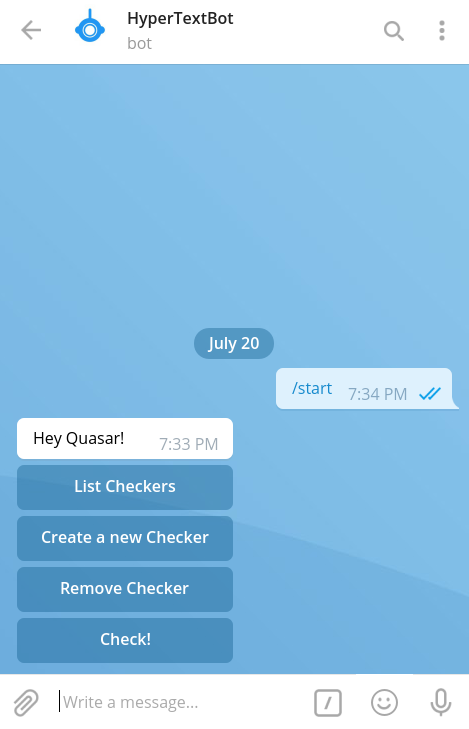

<!-- PROJECT SHIELDS -->
<!--
*** I'm using markdown "reference style" links for readability.
*** Reference links are enclosed in brackets [ ] instead of parentheses ( ).
*** See the bottom of this document for the declaration of the reference variables
*** for build-url, contributors-url, etc. This is an optional, concise syntax you may use.
*** https://www.markdownguide.org/basic-syntax/#reference-style-links
-->
[![Contributors][contributors-shield]][contributors-url]
[![LinkedIn][linkedin-shield]][linkedin-url]


<!-- PROJECT LOGO -->
<br />
<p align="center">
  <a href="https://github.com/aayushdutt/telegram-updater-bot">
    
  </a>

  <h3 align="center">HyperText Updater Bot</h3>

  <p align="center">
    A Telegram Bot which updates you about anything on the internet!
    <br />
    <br />
    <a href="https://telegram.me/notilyBot">Use</a>
    ·
    <a href="https://github.com//aayushdutt/telegram-updater-bot/issues">Report Bug</a>
    ·
    <a href="https://github.com//aayushdutt/telegram-updater-bot/issues">Request Feature</a>
  </p>
</p>


<!-- TABLE OF CONTENTS -->
## Table of Contents

* [About the Project](#about-the-project)
* [Built With](#built-with)
* [Usage](#usage)
* [Contributing](#contributing)
* [License](#license)
* [Contact](#contact)


<!-- ABOUT THE PROJECT -->
## About The Project

<p align="center">
  
</p>


### Built With
* [Node.js](https://nodejs.org/en/)
* [Telegraf](https://github.com/influxdata/telegraf)
* [LowDB](https://github.com/typicode/lowdb)

## Usage
Visit [https://github.com/aayushdutt/telegram-updater-bot](https://github.com/aayushdutt/telegram-updater-bot) to start using the bot.

## Installing Locally

This is an example of how you may give instructions on setting up your project locally.
To get a local copy up and running follow these simple example steps.

### 1. With Docker 

#### Prerequisites
* Docker

#### Installation/Usage
1. To get a API token, create a new bot at [https://telegram.me/BotFather](https://telegram.me/BotFather)
2. Download the [docker-compose.yml](https://raw.githubusercontent.com/aayushdutt/telegram-updater-bot/master/docker-compose.yml) file locally.
3. Enter your Bot Token from step 1 in `TELEGRAM_BOT_TOKEN=` in the `docker-compose.yml` file.
4. Run `docker-compose up -d` to run the Bot locally.

### 2. Without Docker

#### Prerequisites
* Node.js
* npm

#### Installation/Usage

1. To get a API token, create a new bot at [https://telegram.me/BotFather](https://telegram.me/BotFather)
2. Clone the repo
```sh
git clone https:://github.com/your_username_/Project-Name.git
```
3. Install NPM packages
```sh
npm install
```
4. Export your Bot Token from step 1 in environment variables (replace `yourToken` with your own)
```sh
export TELEGRAM_BOT_TOKEN=yourToken
```
5. Run the bot
```sh
npm start
```


<!-- CONTRIBUTING -->
## Contributing

Contributions are what make the open source community such an amazing place to be learn, inspire, and create. Any contributions you make are **greatly appreciated**.

1. Fork the Project
2. Create your Feature Branch (`git checkout -b feature/AmazingFeature`)
3. Commit your Changes (`git commit -m 'Add some AmazingFeature'`)
4. Push to the Branch (`git push origin feature/AmazingFeature`)
5. Open a Pull Request


<!-- CONTACT -->
## Contact

Aayush Dutt - [@aayushdutt](https://twitter.com/aayushdutt) - aayushdutt.cs@gmail.com

Project Link: [https://github.com/aayushdutt/telegram-updater-bot](https://github.com/aayushdutt/telegram-updater-bot)


<!-- MARKDOWN LINKS & IMAGES -->
<!-- https://www.markdownguide.org/basic-syntax/#reference-style-links -->
[contributors-shield]: https://img.shields.io/badge/contributors-1-orange.svg?style=flat-square
[contributors-url]: https://github.com/othneildrew/Best-README-Template/graphs/contributors
[license-shield]: https://img.shields.io/badge/license-MIT-blue.svg?style=flat-square
[linkedin-shield]: https://img.shields.io/badge/-LinkedIn-black.svg?style=flat-square&logo=linkedin&colorB=555
[linkedin-url]: https://linkedin.com/in/aayushdutt
